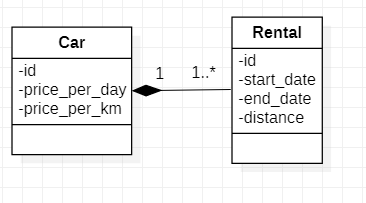
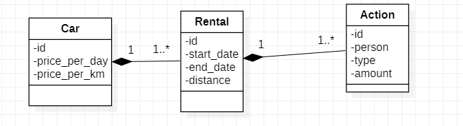
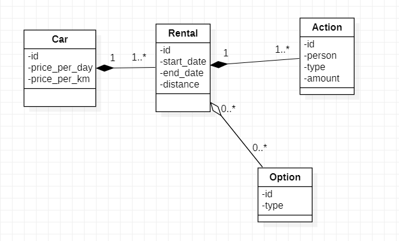

This repo is a technical test I did for a company where I was hired.
This is a API using PHP symfony, The instructions are in the folder "levels".

- For this test I made a symfony project exposing 5 endpoints. For each endpoint the data and the result were given.
- A Postman collection is available to easily test all endpoints(./postman_collection.json).
    - level1: /api/level1
    - level2: /api/level2
    - level3: /api/level3
    - level4: /api/level4
    - level5: /api/level5
- I reused the code from the previous level for each level to keep track of my work. I tried to factorize and handle errors in my code as best I could.
- I used the principles of OOP to achieve the levels.
- If there is any problem don't hesitate to contact me

# Level 1, 2, 3

# Level 4

# Level 5

